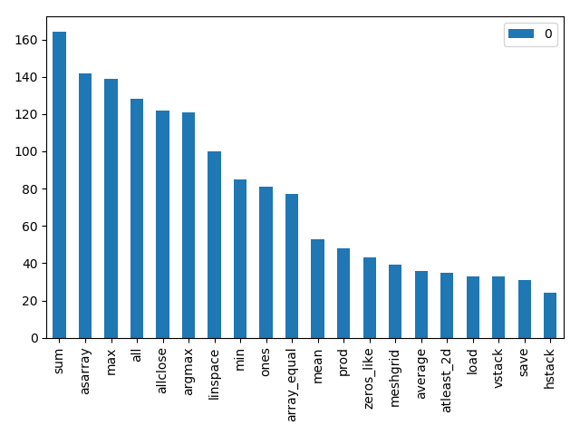

### Assignment :

1. Find any 10 public repositories(which are Numpy based)
2. Download their code in to your machine
3. Find how many numpy methods are used in their code by using python (just read line by line and use Regex to find numpy usage)
4. Show the details in a report.

### Data Report

**method**|**count**
:-----:|:-----:
sum|164
asarray|142
max|139
all|128
allclose|122
argmax|121
linspace|100
min|85
ones|81
array\_equal|77
mean|53
prod|48
zeros\_like|43
meshgrid|39
average|36
atleast\_2d|35
load|33
vstack|33
save|31
hstack|24

### Repos: 
https://github.com/parasdahal/deepnet  
https://github.com/rougier/numpy-100  
https://github.com/Kyubyong/numpy_exercises   
https://github.com/kdexd/digit-classifier  
https://github.com/stasi009/NumpyWDL  
https://github.com/MorvanZhou/simple-neural-networks  
https://github.com/carefree0910/MachineLearning  
https://github.com/Kyubyong/tensorflow-exercises  
https://github.com/kirit93/NumpyTutorial  
https://github.com/ahmedfgad/NumPyCNN  
